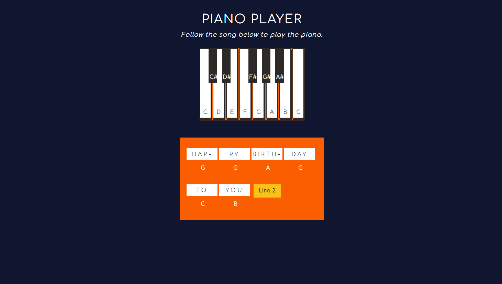

# Piano Keys 

A Codecademy project in the Front End Engineer career path.

## Description 

An interactive piano player game to help beginner-level students study. 

The game functions by using DOM events in JavaScript. 

## Snapshot 

## Credits

Piano Favicon from [Freepik](https://www.flaticon.com/free-icon/piano_570549?term=piano&page=1&position=2&page=1&position=2&related_id=570549&origin=tag)

## Questions 
[Email Me](Chloe.a.harris17@gmail.com) if you have any questions.

Check out more of my work on [GitHub](https://github.com/chloeharris1).